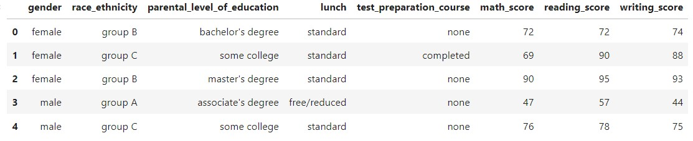

# End to End ML project

A general approach to implement any ML project with an orgnised structure and pipeline. 
The project also is deployed on AWS Elastic Beanstalk with EC2 instance.
#### URL : http://end2endml-env.eba-mtvphctj.eu-west-2.elasticbeanstalk.com/predictdata

### Tech Stack :

* `numpy` 
* `pandas` 
* `scikit-learn` : Also used for data preprocessing and model selection and hyperparameter tuning.
* `Flask` : used to implement a prediction pipeline and present it as a web app
* `xgboost` 
* `catboost`
* `joblib` : to handle model saving and loading

### Data Example :

Student performence dataset 
##### Dataframe Head :

# Approach for the project 

1. Data Ingestion : 
    * Data reading and splitting. 
2. Data Transformation : 
    * used Sklearn to preprocess the data, applied SimpleImputer (median strategy for numeric features and most frequent startegy for categorical features)to handle missing values and Standar Scaling.
    * This preprocessing pipeline is saved using joblib in order to use in the predicition pipeline for unseen/new data.

3. Model Training : 
    * Models tested: Random Forest, DecisionTreeRegressor,GradientBoostingRegressor, LinearRegression, XGBRegressor, CatBoostRegressor, AdaBoostRegressor
    * used GridSearch for hyperparameter tuning   
    * The model with the highest accuracy is saved as a joblib file.

4. Prediction Pipeline : 
    * This pipeline converts given data into dataframe and has various functions to load model and preprocessor files and predict the final results in python.

5. Flask App creation : 
    * Flask app is created to provide a convenient way for user input.

As this approach is general, one can easily replace the data in  [notebook/data](/notebook/data) and edit the data transformer accordingly to train a new model. The model selection will work mainly on regression problems.

**to increase the application performence you can comment out or delete catboost model**

### Todo

- [ ] Create a UI  
- [ ] Present a more detailed analysis for the provided data 
